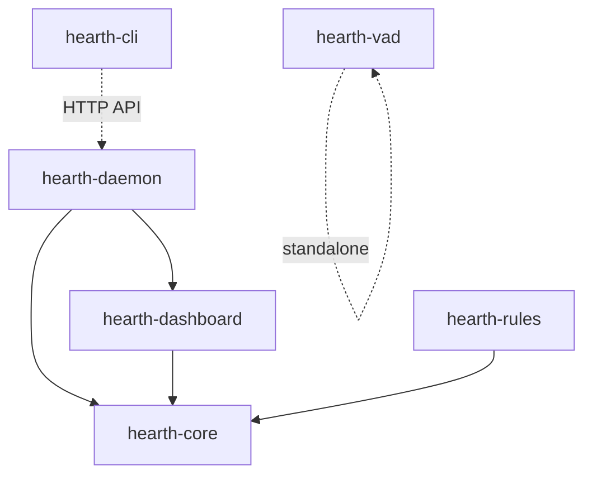

# Hearth

**Local network intelligence.**

> [!IMPORTANT]
> **Disclaimer**: This entire codebase — architecture, implementation, and documentation — was written by **Claude Opus 4.6 (Anthropic)** using **Antigravity IDE by Google**. This is a **prototype** and has **not been fully tested** in production environments. Use at your own risk. Contributions, bug reports, and testing are welcome.

---

## What is Hearth?

Hearth is a local-first network monitoring daemon designed to run on a Raspberry Pi (or any Linux/Windows machine). It passively observes all devices on your network, builds behavioral profiles, detects anomalies, and optionally enforces rules — all without sending a single byte to the cloud.

### Key Features

- **Passive Network Monitoring** — Captures all traffic on your LAN via promiscuous mode
- **Device Profiling** — Builds per-device behavioral baselines over 72+ hours
- **Anomaly Detection** — Flags excessive uploads, new destinations, and unusual activity hours
- **Voice Gate** (experimental) — Detects smart speaker audio uploads without wake words
- **Soft Blocking** — User-defined nftables rules for rate limiting, time-based blocks, and domain allowlists
- **Dark-Themed Dashboard** — Real-time web UI at `http://localhost:7777`
- **CLI Control** — Full control from the terminal
- **Privacy First** — Zero telemetry, zero outbound connections, zero cloud dependencies

---

## Architecture

```
hearth/
├── crates/
│   ├── hearth-core/         # Packet capture, device registry, stats engine, storage
│   ├── hearth-daemon/       # Main binary — orchestrates all components
│   ├── hearth-dashboard/    # Axum web server + embedded HTML dashboard
│   ├── hearth-vad/          # Voice Activity Detection — standalone binary
│   ├── hearth-rules/        # nftables rule engine + enforcement
│   └── hearth-cli/          # CLI for status, config, manual overrides
├── config/
│   └── hearth.toml          # Default configuration
├── systemd/
│   └── hearth.service       # systemd unit for Linux deployment
└── install.sh               # Single-command Linux installer
```

### Crate Dependency Graph



---

## Quick Start

### Prerequisites

- **Rust** 1.70+ with Cargo
- **CMake** (for building bundled SQLite)
- **Linux**: `libpcap-dev` for packet capture
- **Windows**: [Npcap](https://npcap.com/) for packet capture (falls back to demo mode without it)

### Build

```bash
git clone https://github.com/Dhruvil-8/Hearth.git
cd hearth
cargo build --release --workspace
```

### Run

```bash
# With a config file
./target/release/hearth --config config/hearth.toml

# Or with defaults (auto-detects interface, uses ./hearth.db)
./target/release/hearth
```

The dashboard will be available at **http://127.0.0.1:7777**

### Demo Mode

On systems without packet capture capability (no Npcap/libpcap, or no root/admin), Hearth automatically switches to **demo mode** with synthetic network data — useful for exploring the dashboard without a live network.

---

## Dashboard

The web dashboard provides:

- **Overview** — Device count, total upload today, active anomalies, most active device
- **Device Table** — Live-updating table with name, vendor, IP, traffic stats, and status indicators
- **Device Detail** — Click any device for 24h sparkline, profile info, known destinations, anomaly history
- **Anomaly Banner** — Real-time alerts for detected anomalies with one-click resolve
- **Weekly Digest** — Plain-English summary of the week's network activity

---

## Configuration

Edit `config/hearth.toml`:

```toml
interface = "eth0"              # Network interface (eth0, wlan0, etc.)
dashboard_port = 7777           # Web dashboard port
db_path = "./hearth.db"         # SQLite database path
oui_db_path = "./oui.csv"      # MAC vendor lookup database
geoip_db_path = "./GeoLite2-Country.mmdb"  # GeoIP database

# Give devices friendly names and set rules
[[devices]]
mac = "AA:BB:CC:DD:EE:FF"
label = "Samsung TV"
max_upload_per_hour_mb = 500.0
block_hours = ["23:00", "06:00"]   # Block during sleep hours
```

---

## API Reference

All endpoints return JSON. No authentication in this prototype.

| Method | Endpoint | Description |
|--------|----------|-------------|
| `GET` | `/api/summary` | Dashboard summary stats |
| `GET` | `/api/devices` | All devices with traffic stats |
| `GET` | `/api/devices/:mac/history?hours=24` | Traffic history for a device |
| `GET` | `/api/devices/:mac/profile` | Device behavioral profile |
| `GET` | `/api/devices/:mac/anomalies` | Anomalies for a device |
| `GET` | `/api/anomalies` | All unresolved anomalies |
| `POST` | `/api/anomalies/:id/resolve` | Mark anomaly as resolved |
| `GET` | `/api/digest` | Weekly digest with highlights |

---

## CLI Usage

```bash
hearth-cli status                     # Dashboard summary + device table
hearth-cli devices                    # List all devices
hearth-cli device AA:BB:CC:DD:EE:FF   # Device profile + anomalies
hearth-cli anomalies                  # List unresolved anomalies
hearth-cli resolve 42                 # Resolve anomaly #42
hearth-cli digest                     # Weekly digest
```

---

## Anomaly Detection

Hearth builds a behavioral profile for each device after **72 hours** of observation. Once a profile is mature, three anomaly detectors run on every traffic sample:

| Anomaly | Trigger | Example |
|---------|---------|---------|
| **ExcessiveUpload** | bytes_sent > mean + 3 std dev | "Samsung TV uploaded 2.3 GB — 15x above baseline" |
| **NewDestination** | IP not in known destinations | "Echo Dot connected to new server in Russia" |
| **UnusualHour** | Traffic outside normal active hours | "Philips Hue active at 3am — outside normal hours" |

---

## Project Phases

| Phase | Name | Status | Description |
|-------|------|--------|-------------|
| 1 | The Mirror | Complete | Passive observer + dashboard |
| 2 | The Profiles | Complete | Statistical anomaly detection + digest |
| 3 | The Voice Gate | Stubbed | VAD model interface built, NFQUEUE Linux-only |
| 4 | Soft Blocking | Complete | nftables rule engine (Linux-only enforcement) |
| 5 | CLI | Complete | Full CLI with all commands |

---

## Development

### Building on Windows

The project builds on Windows with the `x86_64-pc-windows-gnu` toolchain:

```powershell
rustup default stable-x86_64-pc-windows-gnu
cargo build --workspace
```

Requires [Npcap](https://npcap.com/) and the [Npcap SDK](https://npcap.com/#download) for packet capture linking. Without Npcap installed, the daemon falls back to demo mode at runtime.

### Building on Linux

```bash
sudo apt install libpcap-dev cmake
cargo build --release --workspace
```

### Running Tests

```bash
cargo test --workspace
```

Tests that link against `pnet` require Npcap (Windows) or libpcap (Linux) at runtime. The store and rules tests use in-memory SQLite and work on all platforms.

---

## Security Notes

- Runs as root only for `CAP_NET_RAW` and `CAP_NET_ADMIN` (see systemd unit)
- Dashboard binds to `127.0.0.1` by default — local access only unless explicitly reconfigured
- No telemetry or outbound connections initiated by Hearth
- Config file should be `chmod 600` in production

---

## Known Limitations

1. **TLS opacity** — Hearth cannot inspect encrypted traffic content. Voice Gate uses traffic pattern heuristics, not content inspection.
2. **GeoIP database** — Requires a separately downloaded MaxMind GeoLite2-Country.mmdb file (free account required). Country lookup is disabled if the file is missing.
3. **OUI database** — MAC vendor lookup requires an offline CSV. Vendor info shows as "Unknown" if the file is missing.
4. **Windows** — nftables rules and NFQUEUE are Linux-only. These features are logged but not enforced on Windows.

---

## License

MIT License — see [LICENSE](LICENSE)

---

## Acknowledgments

- Written by [Claude Opus 4.6](https://www.anthropic.com/) (Anthropic) in [Antigravity IDE](https://blog.google/technology/google-deepmind/) by Google
- Built with [Rust](https://www.rust-lang.org/), [Axum](https://github.com/tokio-rs/axum), [pnet](https://github.com/libpnet/libpnet), and [rusqlite](https://github.com/rusqlite/rusqlite)

---

*Hearth — Because your home network should not phone home.*
